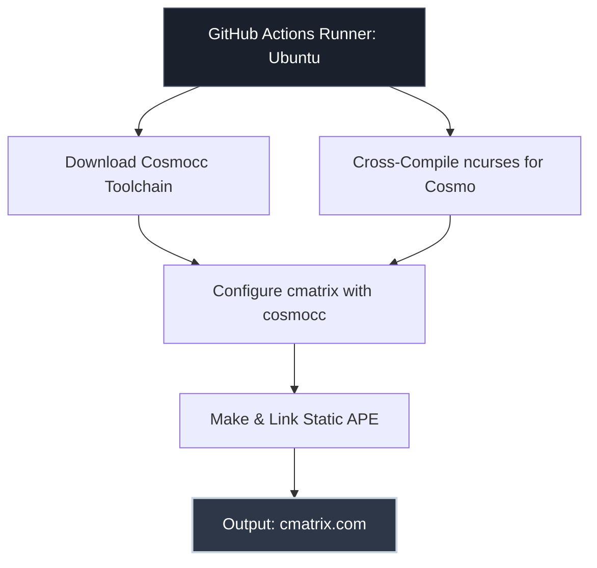

[](https://github.com/Eggertron/cmatrix-cosmopolitan/actions/workflows/build-cmatrix.yml)

# 🌌 Cosmopolitan CMatrix (`cmatrix.com`)

<p align="center">
  <b>The classic digital rain, compiled into a single Actually Portable Executable (APE) using Cosmopolitan Libc.</b><br>
  <i>Run anywhere. Zero dependencies. One binary for Linux, macOS, Windows, and FreeBSD.</i>
</p>

```text
       ,---.          ,---.          ,---.          ,---.          ,---.     
      / / \ \        / / \ \        / / \ \        / / \ \        / / \ \    
     | | 3 | |      | | 7 | |      | | A | |      | | F | |      | | 0 | |   
      \ \_/ /        \ \_/ /        \ \_/ /        \ \_/ /        \ \_/ /    
       `---'          `---'          `---'          `---'          `---'     
```

---

## 🎯 Overview

Normally, running **CMatrix** requires setting up a terminal library like `ncurses` and compiling native binaries for each target operating system (Linux, macOS, Windows). 

By combining **Cosmopolitan Libc** (`cosmocc`) and a statically cross-compiled version of **ncurses**, this repository builds `cmatrix` as an **APE (Actually Portable Executable)**. A single file—`cmatrix.com`—boots natively on multiple processor architectures and operating systems without needing installation or containers.

---

## 🏗️ How It Works (Compilation Architecture)



---

## 🚀 How to Run

Because `cmatrix.com` is an Actually Portable Executable, execution depends slightly on your operating system kernel support for magic numbers and loader scripts:

### 🐧 Linux
If your kernel supports binfmt_misc (standard on most modern Linux distros), execute it directly:
```bash
chmod +x cmatrix.com
./cmatrix.com
```
*If direct execution fails with "Permission denied" or "Exec format error", run it via the Cosmopolitan loader script or sh:*
```bash
sh ./cmatrix.com
```

### 🍎 macOS
macOS natively executes Mach-O binaries, but APE files leverage shell/MZ headers. Run it using standard shell invocation:
```bash
chmod +x cmatrix.com
./cmatrix.com
# Alternatively:
sh ./cmatrix.com
```

### 🪟 Windows (Command Prompt / PowerShell)
Windows treats `.com` files as native console applications. Simply double-click it or run it directly from your terminal:
```cmd
cmatrix.com
```
*(Note: Ensure your Windows console window supports ANSI escape sequences or runs within Windows Terminal).*

### 🐉 FreeBSD / OpenBSD
Run using the POSIX shell wrapper interpretation:
```bash
sh ./cmatrix.com
```

---

## 🎮 Useful CMatrix Flags

Once running, you can customize your digital rain with standard CMatrix flags:

| Flag | Description | Example |
| :--- | :--- | :--- |
| `-a` | Asynchronous scroll | `./cmatrix.com -a` |
| `-b` | Bold characters on | `./cmatrix.com -b` |
| `-B` | All bold characters | `./cmatrix.com -B` |
| `-C [color]` | Change color (green, red, blue, etc.) | `./cmatrix.com -C red` |
| `-s` | Screen saver mode (exits on keystroke) | `./cmatrix.com -s` |

---

## 🙏 Credits & Acknowledgments

* **[Cosmopolitan Libc](https://github.com/jart/cosmopolitan)** by Justine Tunney — For making write-once, run-anywhere C programs a reality through APE technology.
* **[CMatrix](https://github.com/abishekvashok/cmatrix)** by Abishek V Ashok — The modern terminal matrix implementation based on the original work by Chris Allegretta.
* **[ncurses](https://invisible-island.net/ncurses/)** by Thomas Dickey et al. — The foundational terminal screen-handling library.
* 
